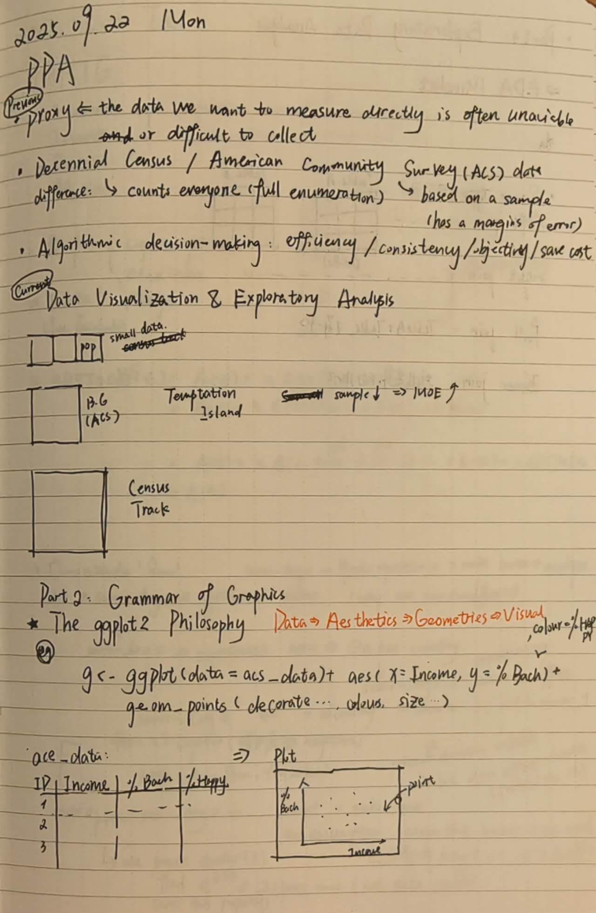
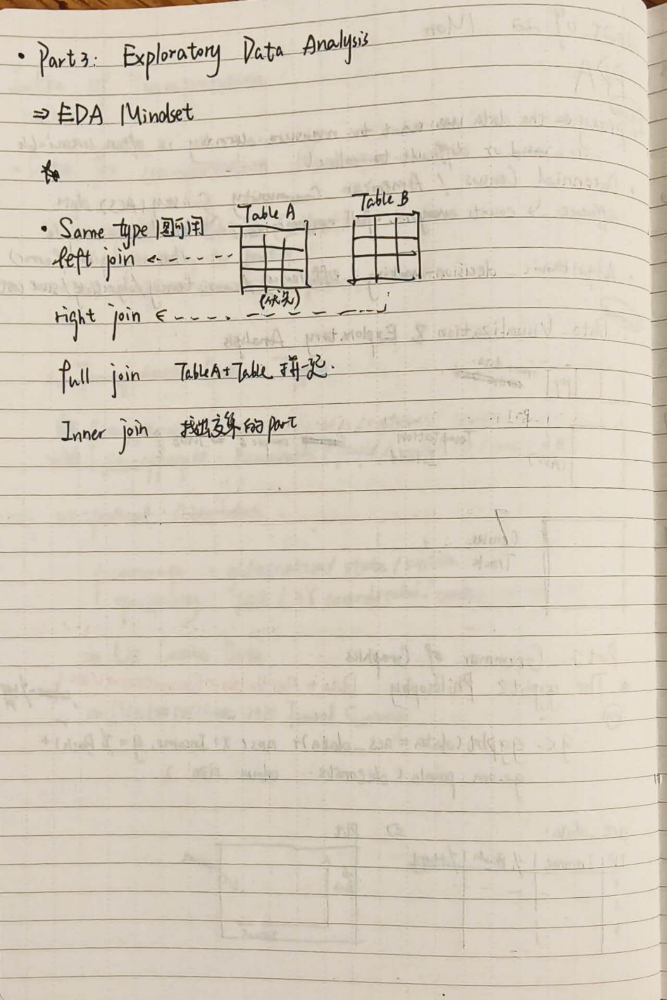

## Key Concepts Learned
- [Previous: proxy; Decennial Census/ ACX data; Algorithmic desicion-making]
- [Current: Datra Visualization & Exploratory Analysis; Grammar of Graphics; Exploring Data Analysis]

## Weekly notes picture
- [Here's the jpg of my notes]
{width=80%}
{width=80%}