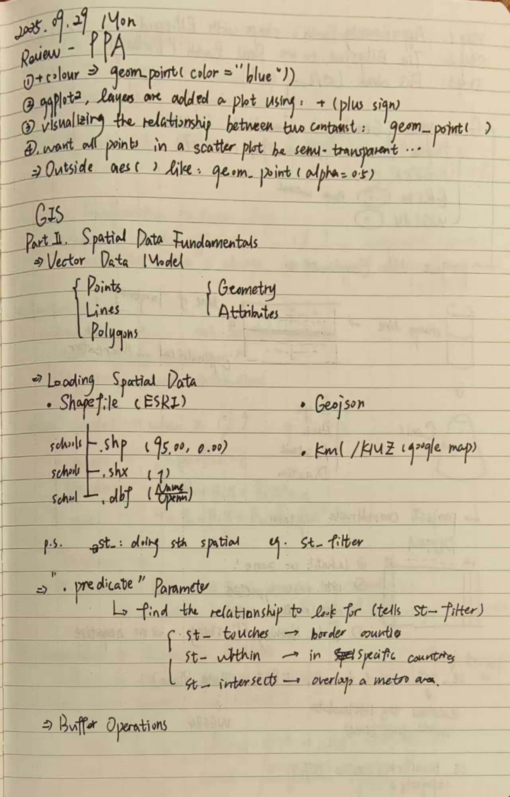
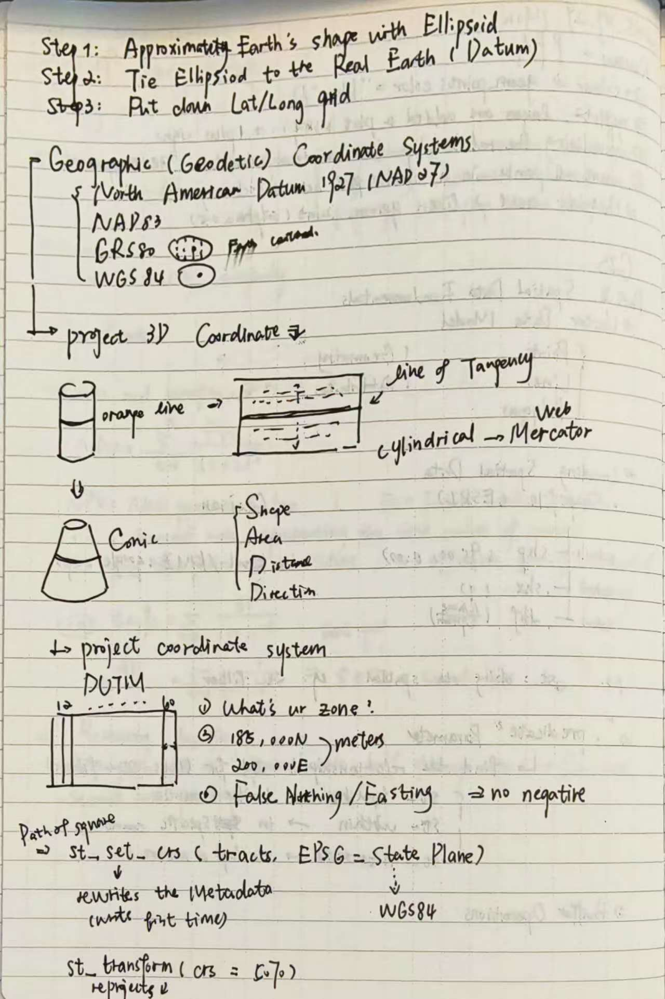

## Key Concepts Learned
- [Previous: geom_point(color = "blue"); ggplot2]
- [Current: Spatial Data Fundamentals; Geographic Coordinate Systems]

## Weekly notes picture
- [Here's two jpgs of my notes]
{width=80%}

{width=80%}