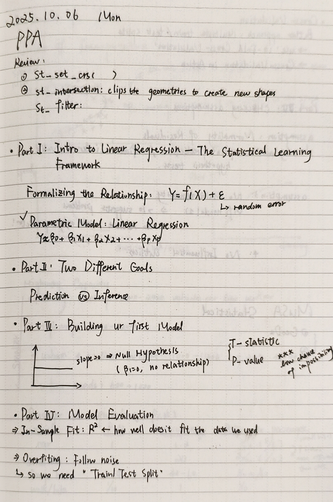
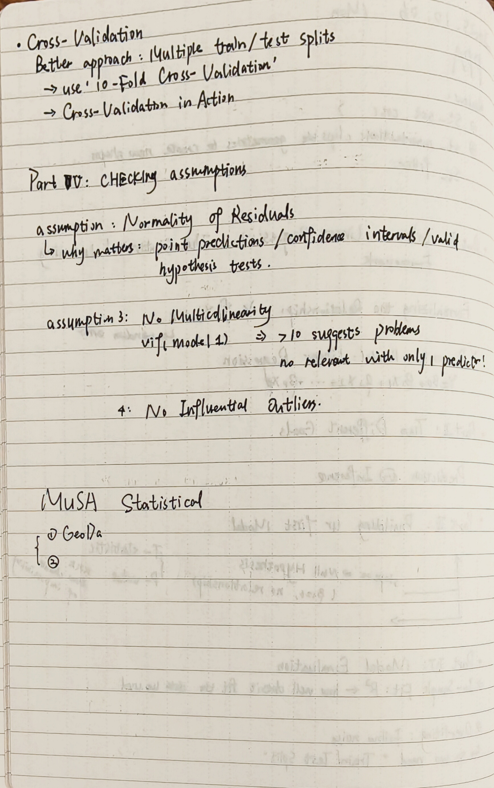

## Key Concepts Learned
- [Previous: st_set_crs(); st_intersection; st_filter]
- [Current: Intro to Linear Regression; Two different Goals: prediction & inference; building model; model evaluation; checking assumption]

## Weekly notes picture
- [Here's two jpgs of my notes]
{width=80%}
{width=80%}